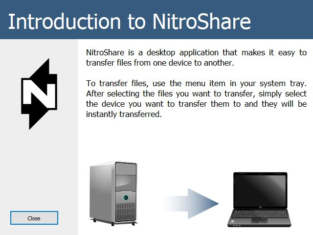
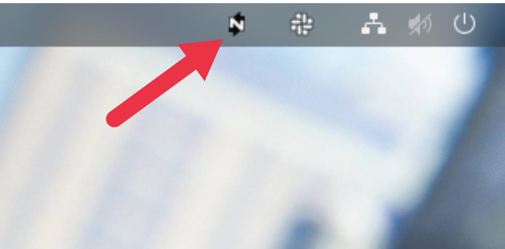
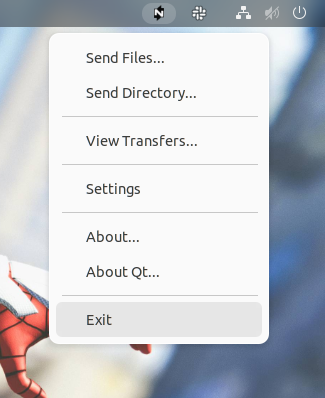
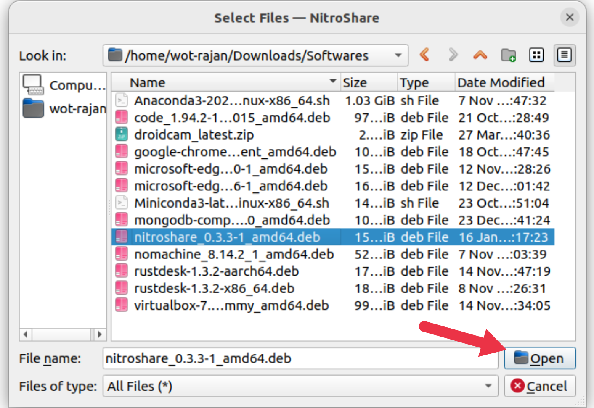
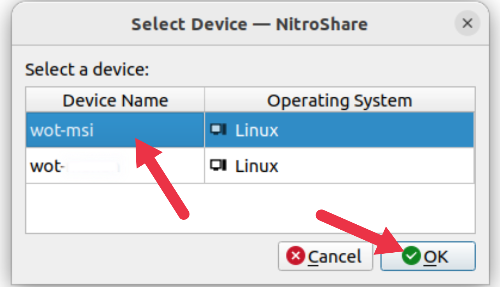
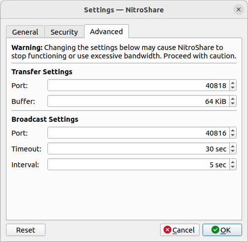

# NitroShare

## Introduction

One of the most important uses of a network is for file sharing purposes. There are multiple ways Linux and Windows, Mac OS X users on a network can now share files with each other. Nitroshare is a cross-platform, open-source and easy-to-use application for sharing files across a local network.

Nitroshare tremendously simplifies file sharing on a local network, once installed, it integrates with the operating system seamlessly. On Ubuntu, simply open it from the applications indicator, and on Windows, check it in the system tray.

Also, it automatically detects every other device on a network that has Nitroshare installed thereby enabling a user to easily transfer files from one machine to another by selecting which device to transfer to.

## Download

### Linux

> **Do not try to install the Nitroshare on Ubuntu from GitHub or by `apt` with PPA because the latest version of the Nitroshare have many dependencies issues with Ubuntu. Also the `.deb` file of latest version of Nitroshare is not available. This is the guide to install the Nitroshare version `0.3.3`.**

- To download the Nitroshare - 0.3.3 for Ubuntu [Click Here](https://launchpad.net/ubuntu/+archive/primary/+files/nitroshare_0.3.3-1_amd64.deb) or run the following command:

    ```bash
    wget https://launchpad.net/ubuntu/+archive/primary/+files/nitroshare_0.3.3-1_amd64.deb
    ```

- Or Download the `.deb` file available in this repository. You can also run the following command to download the `.deb` package available in this repository.

    ```bash
    wget https://raw.githubusercontent.com/Rajan1247/Installation_Guides/main/NitroShare/nitroshare_0.3.3-1_amd64.deb
    ```

- Once you have downloaded the Nitroshare `.deb` file run the following command in the terminal to install the Nitroshare.

    ```bash
    sudo dpkg -i nitroshare_0.3.3-1_amd64.deb
    ```

## Usage

- Once you have installed the Nitroshare you can open it from the application menu. Once you open the NitroShare it will show the following screen:

    

- Click on the Close button. Now the NitroShare will run in the background and you can access it with your system tray. You can find the NitroShare Icon in your system tray at top-right corner shown as below:

    

- When you click on the NitroShare Icon in the system tray you can see the following drop-down menu. From here you can send files to any system in your local network. Also you can configure the NitroShare from the settings menu.

    

- Once you click on the `Send Files...` or `Send Directory...` option you can select the file or entire directory you want to share and click on `Open`. When you click on the `Open` after selecting the file or directory you will be shown to available systems in your local network as shown in the second image. Just click on the system to which you want to share.

    

    

## Troubleshoot

### Installation Error

- While installing the `.deb` file you might encounter a similar error like below:

    ```bash
    dpkg: dependency problems prevent configuration of nitroshare:
    nitroshare depends on libqmdnsengine0 (>= 0.1.0); however:
    Package libqmdnsengine0 is not installed.

    dpkg: error processing package nitroshare (--install):
    dependency problems - leaving unconfigured
    Processing triggers for ufw (0.36.1-4ubuntu0.1) ...
    Processing triggers for mailcap (3.70+nmu1ubuntu1) ...
    Processing triggers for gnome-menus (3.36.0-1ubuntu3) ...
    Processing triggers for desktop-file-utils (0.26-1ubuntu3) ...
    Processing triggers for hicolor-icon-theme (0.17-2) ...
    Processing triggers for man-db (2.10.2-1) ...
    Errors were encountered while processing:
    nitroshare
    ```


- It states that the package named `libqmdnsengine0` is missing. So, you have to install the package manually using `apt` with the following command:

    ```bash
    sudo apt install libqmdnsengine0
    ```

- After the above installation completes, install the NitroShare again and it should install without error. If you encounter error for other missing packages also kindly install it with `apt`.

### Network Firewall

-  The devices to your local network are not visible to share files, it's probably due to the firewall does not allow the port used by NitroShare. When you click on the `Settings` option of Nitroshare from system tray and go to the `Advanced` tab. Here you can change your **Transfer** and **Broadcast** ports.

- If you use **Uncomplicated Firewall(UFW)** then you'll need to add the **Transfer** and **Broadcast** ports to your firewall rules. You can identify your **Transfer** and **Broadcast** ports from the `Advanced` tab of settings as shown below:

    

- Once you have the **Transfer** and **Broadcast** ports add them to your firewall rules using the following command:

    ```bash
    # ​sudo ufw allow <port>
    ​sudo ufw allow 40818
    sudo ufw allow 40816
    ```

- Now you are able to see the available systems in your local networks.