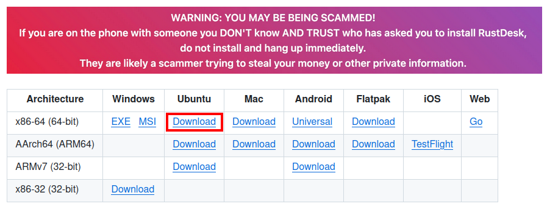
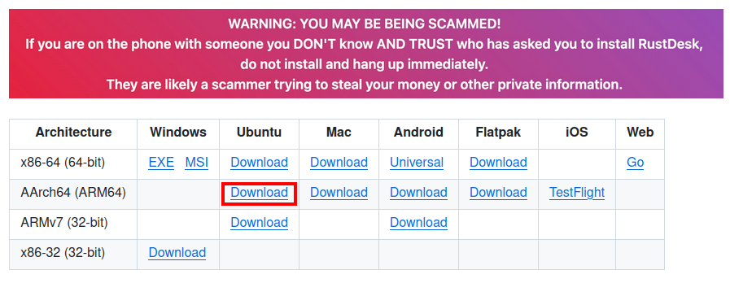
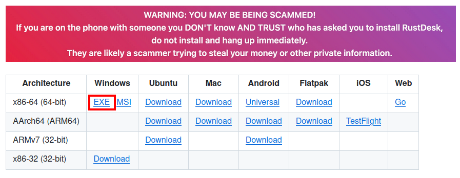
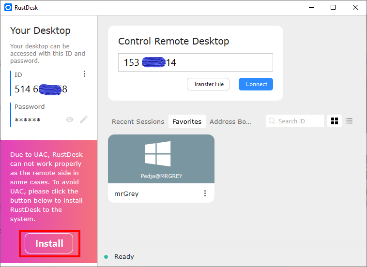
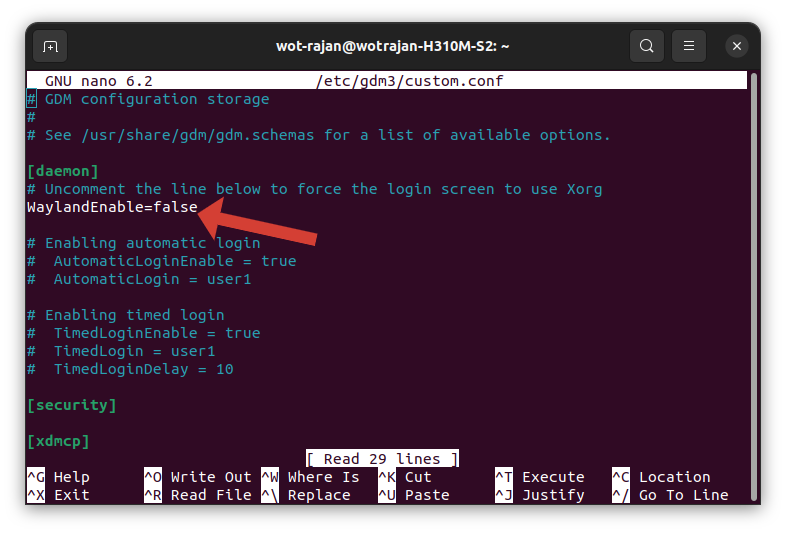
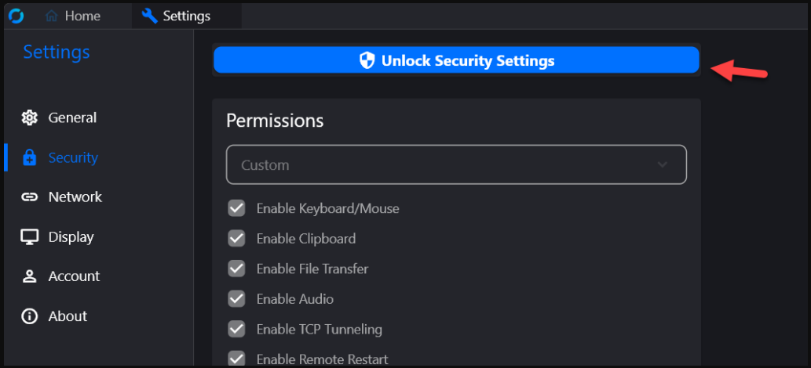
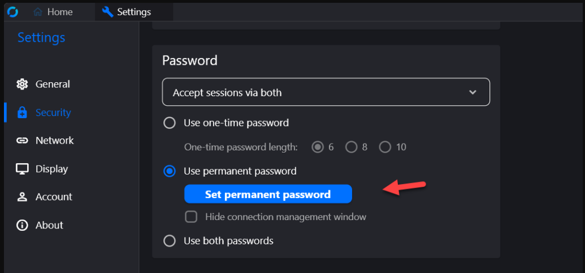
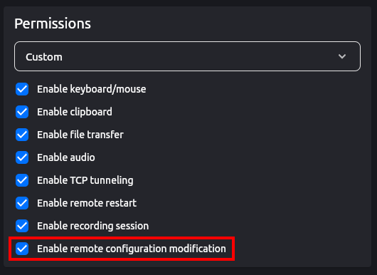

# RustDesk Installation 

## Summary
- This Repository is a guide to install the RustDesk in Linux-x86_64, ARM Devices(aarch64) and Windows system. RustDesk is a remote access and remote control software, primarily written in Rust, that enables remote maintenance of computers and other devices. The RustDesk client runs on operating systems such as Microsoft Windows, Apple MacOS, Apple iOS, Android and common Linux distributions. RustDesk has the aspiration to be an open-source alternative to remote desktop software such as TeamViewer or AnyDesk. As a result, RustDesk can function without relying on additional tools such as VPNs or port forwarding, even behind firewalls or NATs.
- It contains the guides about installation of following tools
  - **RustDesk**

<details>

<summary><b>Table of Contents</b></summary>

- **[Downlaod](#download)**
- **[Installation](#installation)**
    - [Linux](#linux)
    - [Windows](#windows)
- **[TroubleShooting](#troubleshooting)**
    - [Installation Error (Linux)](#installation-error-linux)
    - [Login Screen Access (Linux)](#login-screen-access-linux)
- **[Configuration](#configuration)**
    - [Set Permanent Password for Connection](#set-permanent-password-for-connection)
    - [Enable Remote Configuration Modification](#enable-remote-configuration-modification)

</details>

## Download
Download the RustDesk `.deb` file for **Linux-x86_64** or **ARM Devices(aarch64)** or `.exe` file for **Windows** by clicking the links below. (Version 1.3.2 as of this writing)

[Linux-x86_64](https://github.com/rustdesk/rustdesk/releases/download/1.3.2/rustdesk-1.3.2-x86_64.deb) | [ARM Devices(aarch64)](https://github.com/rustdesk/rustdesk/releases/download/1.3.2/rustdesk-1.3.2-aarch64.deb) | [Windows](https://github.com/rustdesk/rustdesk/releases/download/1.3.2/rustdesk-1.3.2-x86_64.exe)

Or check the [Github Release Page](https://github.com/rustdesk/rustdesk/releases) to download the latest version. And download the RustDesk file as per you system.

**Linux-x86_64**



**ARM Devices(aarch64)**



**Windows**




## Installation
### Linux

1. Run following command to ensures that your Ubuntu system is up-to-date.
    ```bash
    sudo apt update && sudo apt upgrade -y
    ```

2. (Only if not downlaoded earlier with [Github Release Page](https://github.com/rustdesk/rustdesk/releases)) To download the `.deb` (Version 1.3.2) file with `Terminal` run the following command:

    - Linux-x86_64
    ```bash
    wget https://github.com/rustdesk/rustdesk/releases/download/1.3.2/rustdesk-1.3.2-x86_64.deb
    ```
    - ARM Devices(aarch64)
    ```bash
    wget https://github.com/rustdesk/rustdesk/releases/download/1.3.2/rustdesk-1.3.2-aarch64.deb
    ```

3. To install the downloaded `.deb` package of rustdesk run the following command:
    - Linux-x86_64
    ```bash
    sudo apt install ./rustdesk-1.3.2-x86_64.deb 
    ```
    - ARM Devices (aarch64)
    ```bash
    sudo apt install ./rustdesk-1.3.2-aarch64.deb
    ```

### Windows
1. Double Click on the downloaded `.exe` file to open the Rustdesk
    - You can use the RustDesk like this but you have to run the `.exe` file everytime you want to open the RustDesk.
    - To add the RustDesk in your system click the Install button shown in below figure.

    

## TroubleShooting
### Installation Error (Linux)
When we try to install the RustDesk's `.deb` file with `dpkg` instead of `apt` it will just unpack the `.deb` file and try to install it as-is without automatically resolving any missing dependecies. Because the `dpkg` will installs the package directly, without handling dependencies.
```bash
sudo dpkg -i rustdesk-1.3.2-x86_64.deb
```
 And becuase of this you might get the following error while installing the RusatDesk if the dependencies is not already intsalled in your system.
```bash
Selecting previously unselected package rustdesk.
(Reading database ... 223199 files and directories currently installed.)
Preparing to unpack rustdesk-1.3.2-x86_64.deb ...
Failed to stop rustdesk.service: Unit rustdesk.service not loaded.
Unpacking rustdesk (1.3.2) ...
dpkg: dependency problems prevent configuration of rustdesk:
 rustdesk depends on libxdo3; however:
  Package libxdo3 is not installed.

dpkg: error processing package rustdesk (--install):
 dependency problems - leaving unconfigured
Processing triggers for mailcap (3.70+nmu1ubuntu1) ...
Processing triggers for gnome-menus (3.36.0-1ubuntu3) ...
Processing triggers for desktop-file-utils (0.26-1ubuntu3) ...
Processing triggers for hicolor-icon-theme (0.17-2) ...
Errors were encountered while processing:
 rustdesk
```

To solve this error we can follow either of the following steps:
1. Installing the RustDesk with `apt`. (Recommended)
    ```bash
    sudo apt --fix-broken install
    ```
    Linux-x86_64
    ```bash
    sudo apt install ./rustdesk-1.3.2-x86_64.deb
    ```
    ARM Devices(aarch64)
    ```bash
    sudo apt install ./rustdesk-1.3.2-aarch64.deb
    ```

2. Installing the dependencies manually and then install the RustDesk with `dpkg`. The `dpkg` command will list the dependencies which are missing and we can download it using the following command:
    ```bash
    sudo apt install <package_name>
    ```
    Linux-x86_64
    ```bash
    sudo dpkg -i rustdesk-1.3.2-x86_64.deb
    ```
    ARM Devices(aarch64)
    ```bash
    sudo dpkg -i rustdesk-1.3.2-aarch64.deb
    ```

### Login Screen Access (Linux)

Rustdesk will use the WayLand by default in the Linux System. And the Login screen using Wayland is not supported yet. If you want to access login screen after reboot or logout with RustDesk, you need to change login screen to X11.

To change the login screen to X11 open `custom.conf` with sudo access and uncomment `#WaylandEnable=false` by removing the `#`.

After uncommenting the `#WaylandEnable=false` press `Ctrl+X` then type `Y` and press `Enter` to save the changes.

```bash
sudo nano /etc/gdm3/custom.conf
```
or
```bash
sudo nano /etc/gdm/custom.conf
```



## Configuration

### Set Permanent Password for Connection

RustDesk provides 2 types of password for the remote connection.
1. **One-time Password:** As the Name suggest it is a one-time password for the remote connection which will change after a connection. We can also changethe length of the password to 4, 6 and 10 latters. 
2. **Permanent Passsword:** Unlike the one-time password this will remian the same until you change it. User can access the remote view of your desktop with this password everytime. To Set/Change the permanent password follow this steps:
    1. Go to Settings.
    2. Then click on “Unlock Security Settings” and scroll down.

    

    3. Click on Set parmanent password and set the desired password.

    

## Enable Remote Configuration Modification

To give the full access to the remote user you have to enable the "Remote Configuration Modification." This will give the remote user to change and modify all the settings in the RustDesk. Which means the remote user can change or remove the passwords and alter other settings in RustDesk.

To Enable the Remote Configuration Modification follow this steps:

1. Go to Settings.

2. Then click on “Unlock Security Settings” and scroll down.


3. Make sure that "Enable Remote Configuration Modification" is Enabled.

